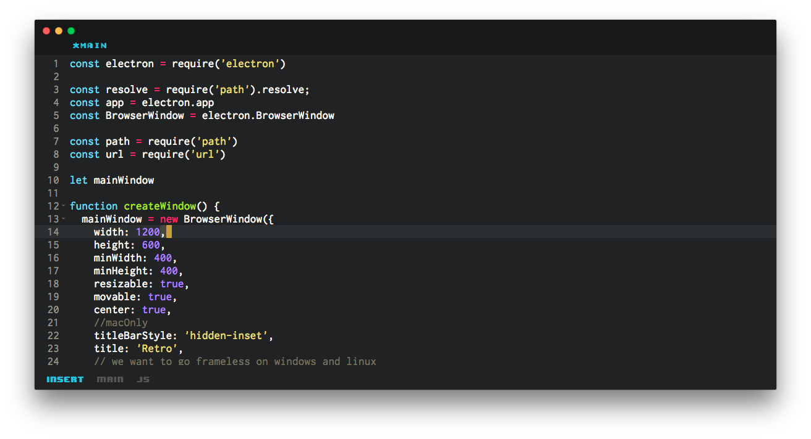

# Retro [Work in Progress]

> A Vim Based Editor for the 30th Century

Status: A lot of work to do, but [you can help solving issues](https://github.com/raphamorim/retro/issues).

## Why?

Retro is a project that seeks to aggressively rethink Vim in order to:

- A lot of popular plugins ported to Retro
- Minimalist and Simplest visual ever
- Chromium-based GUI
- Enable advanced external UIs without modifications to the core
- Full Extensible'n Hackable Editor (allow to change interfaces brutally)
	- Improve extensibility with a new plugin architecture

## Objective

The goal of the project is to create a extensible/hackable experience for VIM users, built on open web standards.

Nowadays our focus will be specifically about speed, stability, experience and productivity.

## About

Authored by Raphael Amorim - [@raphamundi](https://twitter.com/raphamundi)

License: [MIT](LICENSE)
